# Skill graph

This derived file summarizes maturity, lineage, scope, invocation, and technique edges for the current skill surface.

```mermaid
graph TD
  skill_aoa_adr_write["aoa-adr-write"]
  status_evaluated["status: evaluated"]
  scope_core["scope: core"]
  lineage_pending["lineage: pending"]
  policy_explicit_preferred["invocation: explicit-preferred"]
  technique_AOA_T_PENDING_ADR_WRITE["AOA-T-PENDING-ADR-WRITE"]
  skill_aoa_approval_gate_check["aoa-approval-gate-check"]
  scope_risk["scope: risk"]
  policy_explicit_only["invocation: explicit-only"]
  technique_AOA_T_PENDING_APPROVAL_GATE_CHECK["AOA-T-PENDING-APPROVAL-GATE-CHECK"]
  skill_aoa_bounded_context_map["aoa-bounded-context-map"]
  status_canonical["status: canonical"]
  lineage_published["lineage: published"]
  technique_AOA_T_0016["AOA-T-0016"]
  technique_AOA_T_0002["AOA-T-0002"]
  skill_aoa_change_protocol["aoa-change-protocol"]
  technique_AOA_T_0001["AOA-T-0001"]
  skill_aoa_contract_test["aoa-contract-test"]
  technique_AOA_T_0003["AOA-T-0003"]
  technique_AOA_T_0015["AOA-T-0015"]
  skill_aoa_core_logic_boundary["aoa-core-logic-boundary"]
  technique_AOA_T_PENDING_CORE_LOGIC_BOUNDARY["AOA-T-PENDING-CORE-LOGIC-BOUNDARY"]
  skill_aoa_dry_run_first["aoa-dry-run-first"]
  technique_AOA_T_PENDING_DRY_RUN_FIRST["AOA-T-PENDING-DRY-RUN-FIRST"]
  technique_AOA_T_0004["AOA-T-0004"]
  skill_aoa_invariant_coverage_audit["aoa-invariant-coverage-audit"]
  technique_AOA_T_0017["AOA-T-0017"]
  skill_aoa_port_adapter_refactor["aoa-port-adapter-refactor"]
  technique_AOA_T_PENDING_PORT_ADAPTER_REFACTOR["AOA-T-PENDING-PORT-ADAPTER-REFACTOR"]
  skill_aoa_property_invariants["aoa-property-invariants"]
  technique_AOA_T_0007["AOA-T-0007"]
  skill_aoa_safe_infra_change["aoa-safe-infra-change"]
  technique_AOA_T_PENDING_SAFE_INFRA_CHANGE["AOA-T-PENDING-SAFE-INFRA-CHANGE"]
  skill_aoa_sanitized_share["aoa-sanitized-share"]
  technique_AOA_T_PENDING_SANITIZED_SHARE["AOA-T-PENDING-SANITIZED-SHARE"]
  skill_aoa_source_of_truth_check["aoa-source-of-truth-check"]
  technique_AOA_T_PENDING_SOURCE_OF_TRUTH_CHECK["AOA-T-PENDING-SOURCE-OF-TRUTH-CHECK"]
  skill_aoa_tdd_slice["aoa-tdd-slice"]
  technique_AOA_T_0014["AOA-T-0014"]
  skill_atm10_change_protocol["atm10-change-protocol"]
  status_scaffold["status: scaffold"]
  scope_project["scope: project"]
  skill_atm10_source_of_truth_check["atm10-source-of-truth-check"]
  skill_aoa_adr_write -->|maturity| status_evaluated
  skill_aoa_adr_write -->|scope| scope_core
  skill_aoa_adr_write -->|lineage| lineage_pending
  skill_aoa_adr_write -->|invocation_policy| policy_explicit_preferred
  skill_aoa_adr_write -->|depends_on| technique_AOA_T_PENDING_ADR_WRITE
  skill_aoa_approval_gate_check -->|maturity| status_evaluated
  skill_aoa_approval_gate_check -->|scope| scope_risk
  skill_aoa_approval_gate_check -->|lineage| lineage_pending
  skill_aoa_approval_gate_check -->|invocation_policy| policy_explicit_only
  skill_aoa_approval_gate_check -->|depends_on| technique_AOA_T_PENDING_APPROVAL_GATE_CHECK
  skill_aoa_bounded_context_map -->|maturity| status_canonical
  skill_aoa_bounded_context_map -->|scope| scope_core
  skill_aoa_bounded_context_map -->|lineage| lineage_published
  skill_aoa_bounded_context_map -->|invocation_policy| policy_explicit_preferred
  skill_aoa_bounded_context_map -->|depends_on| technique_AOA_T_0016
  skill_aoa_bounded_context_map -->|depends_on| technique_AOA_T_0002
  skill_aoa_change_protocol -->|maturity| status_canonical
  skill_aoa_change_protocol -->|scope| scope_core
  skill_aoa_change_protocol -->|lineage| lineage_published
  skill_aoa_change_protocol -->|invocation_policy| policy_explicit_preferred
  skill_aoa_change_protocol -->|depends_on| technique_AOA_T_0001
  skill_aoa_change_protocol -->|depends_on| technique_AOA_T_0002
  skill_aoa_contract_test -->|maturity| status_canonical
  skill_aoa_contract_test -->|scope| scope_core
  skill_aoa_contract_test -->|lineage| lineage_published
  skill_aoa_contract_test -->|invocation_policy| policy_explicit_preferred
  skill_aoa_contract_test -->|depends_on| technique_AOA_T_0003
  skill_aoa_contract_test -->|depends_on| technique_AOA_T_0015
  skill_aoa_core_logic_boundary -->|maturity| status_evaluated
  skill_aoa_core_logic_boundary -->|scope| scope_core
  skill_aoa_core_logic_boundary -->|lineage| lineage_pending
  skill_aoa_core_logic_boundary -->|invocation_policy| policy_explicit_preferred
  skill_aoa_core_logic_boundary -->|depends_on| technique_AOA_T_PENDING_CORE_LOGIC_BOUNDARY
  skill_aoa_dry_run_first -->|maturity| status_evaluated
  skill_aoa_dry_run_first -->|scope| scope_risk
  skill_aoa_dry_run_first -->|lineage| lineage_pending
  skill_aoa_dry_run_first -->|invocation_policy| policy_explicit_only
  skill_aoa_dry_run_first -->|depends_on| technique_AOA_T_PENDING_DRY_RUN_FIRST
  skill_aoa_dry_run_first -->|depends_on| technique_AOA_T_0004
  skill_aoa_invariant_coverage_audit -->|maturity| status_canonical
  skill_aoa_invariant_coverage_audit -->|scope| scope_core
  skill_aoa_invariant_coverage_audit -->|lineage| lineage_published
  skill_aoa_invariant_coverage_audit -->|invocation_policy| policy_explicit_preferred
  skill_aoa_invariant_coverage_audit -->|depends_on| technique_AOA_T_0017
  skill_aoa_port_adapter_refactor -->|maturity| status_evaluated
  skill_aoa_port_adapter_refactor -->|scope| scope_core
  skill_aoa_port_adapter_refactor -->|lineage| lineage_pending
  skill_aoa_port_adapter_refactor -->|invocation_policy| policy_explicit_preferred
  skill_aoa_port_adapter_refactor -->|depends_on| technique_AOA_T_PENDING_PORT_ADAPTER_REFACTOR
  skill_aoa_property_invariants -->|maturity| status_canonical
  skill_aoa_property_invariants -->|scope| scope_core
  skill_aoa_property_invariants -->|lineage| lineage_published
  skill_aoa_property_invariants -->|invocation_policy| policy_explicit_preferred
  skill_aoa_property_invariants -->|depends_on| technique_AOA_T_0017
  skill_aoa_property_invariants -->|depends_on| technique_AOA_T_0007
  skill_aoa_safe_infra_change -->|maturity| status_evaluated
  skill_aoa_safe_infra_change -->|scope| scope_risk
  skill_aoa_safe_infra_change -->|lineage| lineage_pending
  skill_aoa_safe_infra_change -->|invocation_policy| policy_explicit_only
  skill_aoa_safe_infra_change -->|depends_on| technique_AOA_T_PENDING_SAFE_INFRA_CHANGE
  skill_aoa_safe_infra_change -->|depends_on| technique_AOA_T_0001
  skill_aoa_sanitized_share -->|maturity| status_evaluated
  skill_aoa_sanitized_share -->|scope| scope_risk
  skill_aoa_sanitized_share -->|lineage| lineage_pending
  skill_aoa_sanitized_share -->|invocation_policy| policy_explicit_only
  skill_aoa_sanitized_share -->|depends_on| technique_AOA_T_PENDING_SANITIZED_SHARE
  skill_aoa_source_of_truth_check -->|maturity| status_evaluated
  skill_aoa_source_of_truth_check -->|scope| scope_core
  skill_aoa_source_of_truth_check -->|lineage| lineage_pending
  skill_aoa_source_of_truth_check -->|invocation_policy| policy_explicit_preferred
  skill_aoa_source_of_truth_check -->|depends_on| technique_AOA_T_PENDING_SOURCE_OF_TRUTH_CHECK
  skill_aoa_source_of_truth_check -->|depends_on| technique_AOA_T_0002
  skill_aoa_tdd_slice -->|maturity| status_canonical
  skill_aoa_tdd_slice -->|scope| scope_core
  skill_aoa_tdd_slice -->|lineage| lineage_published
  skill_aoa_tdd_slice -->|invocation_policy| policy_explicit_preferred
  skill_aoa_tdd_slice -->|depends_on| technique_AOA_T_0014
  skill_aoa_tdd_slice -->|depends_on| technique_AOA_T_0001
  skill_atm10_change_protocol -->|maturity| status_scaffold
  skill_atm10_change_protocol -->|scope| scope_project
  skill_atm10_change_protocol -->|lineage| lineage_published
  skill_atm10_change_protocol -->|invocation_policy| policy_explicit_preferred
  skill_atm10_change_protocol -->|depends_on| technique_AOA_T_0001
  skill_atm10_change_protocol -->|depends_on| technique_AOA_T_0002
  skill_atm10_source_of_truth_check -->|maturity| status_scaffold
  skill_atm10_source_of_truth_check -->|scope| scope_project
  skill_atm10_source_of_truth_check -->|lineage| lineage_pending
  skill_atm10_source_of_truth_check -->|invocation_policy| policy_explicit_preferred
  skill_atm10_source_of_truth_check -->|depends_on| technique_AOA_T_PENDING_SOURCE_OF_TRUTH_CHECK
  skill_atm10_source_of_truth_check -->|depends_on| technique_AOA_T_0002
```

| name | status | scope | invocation | lineage | techniques |
|---|---|---|---|---|---|
| aoa-adr-write | evaluated | core | explicit-preferred | pending | AOA-T-PENDING-ADR-WRITE |
| aoa-approval-gate-check | evaluated | risk | explicit-only | pending | AOA-T-PENDING-APPROVAL-GATE-CHECK |
| aoa-bounded-context-map | canonical | core | explicit-preferred | published | AOA-T-0016, AOA-T-0002 |
| aoa-change-protocol | canonical | core | explicit-preferred | published | AOA-T-0001, AOA-T-0002 |
| aoa-contract-test | canonical | core | explicit-preferred | published | AOA-T-0003, AOA-T-0015 |
| aoa-core-logic-boundary | evaluated | core | explicit-preferred | pending | AOA-T-PENDING-CORE-LOGIC-BOUNDARY |
| aoa-dry-run-first | evaluated | risk | explicit-only | pending | AOA-T-PENDING-DRY-RUN-FIRST, AOA-T-0004 |
| aoa-invariant-coverage-audit | canonical | core | explicit-preferred | published | AOA-T-0017 |
| aoa-port-adapter-refactor | evaluated | core | explicit-preferred | pending | AOA-T-PENDING-PORT-ADAPTER-REFACTOR |
| aoa-property-invariants | canonical | core | explicit-preferred | published | AOA-T-0017, AOA-T-0007 |
| aoa-safe-infra-change | evaluated | risk | explicit-only | pending | AOA-T-PENDING-SAFE-INFRA-CHANGE, AOA-T-0001 |
| aoa-sanitized-share | evaluated | risk | explicit-only | pending | AOA-T-PENDING-SANITIZED-SHARE |
| aoa-source-of-truth-check | evaluated | core | explicit-preferred | pending | AOA-T-PENDING-SOURCE-OF-TRUTH-CHECK, AOA-T-0002 |
| aoa-tdd-slice | canonical | core | explicit-preferred | published | AOA-T-0014, AOA-T-0001 |
| atm10-change-protocol | scaffold | project | explicit-preferred | published | AOA-T-0001, AOA-T-0002 |
| atm10-source-of-truth-check | scaffold | project | explicit-preferred | pending | AOA-T-PENDING-SOURCE-OF-TRUTH-CHECK, AOA-T-0002 |

